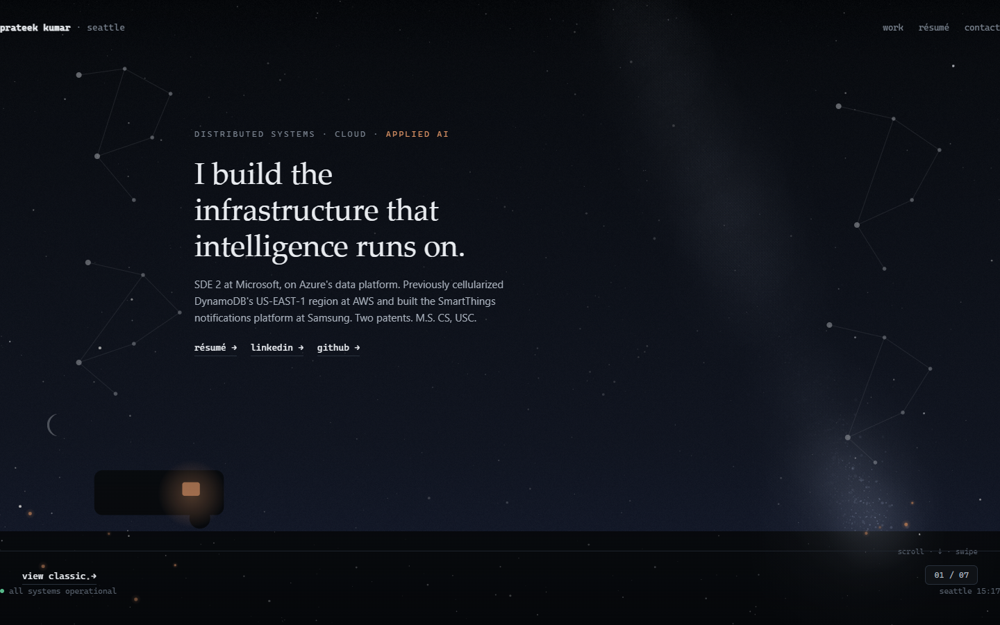
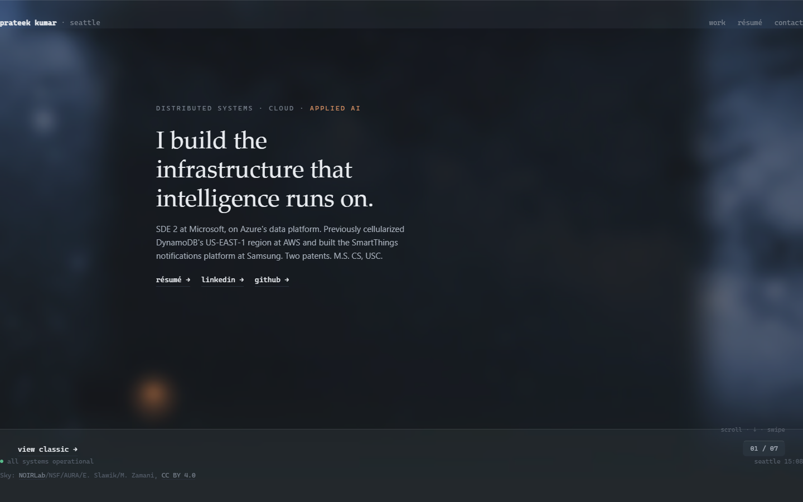

# v3.0 "Real Sky" — Launch Readiness (go/no-go pack)

**Date:** 2026-07-19 · **Decision owner:** you · **This plan pushed NOTHING** (verified below).
The 10-02 deploy is gated on your explicit go. Read the two hero shots and the gate table —
that is the whole call. Everything else is appendix.

---

## 1. What changes live

`p2401kumar.github.io` flips from the v2.0 **procedural** night sky (canvas-drawn stars/Milky
Way, live ~1 day) to the v3.0 **real-sky composite**: the real NOIRLab Milky Way
astrophotograph behind everything, frosted-glass panel/header/footer/jump-index chrome, and
the living ambient scene — drifting clouds, panel-change parallax, breathing aurora,
atmospheric scintillation. Same substance, real sky: content is unchanged and unforked (the
same 7 v1 panels), the two case studies stay scene-free, and view-classic + no-JS still fall
back to the v1-style page. You knew this trajectory — no drama. The push is **65 local
commits** ahead of origin/main (first v3 commit: `3fbbcd2 docs: start milestone v3.0 Real
Sky`).

## 2. Before / after — the 60-second call

| v2.0 LIVE today (captured read-only from https://p2401kumar.github.io/) | v3.0 local build (this plan) |
|---|---|
|  |  |
| Procedural sky: canvas stars + constellations, flat gradient | Real photo: NOIRLab Milky Way + glass chrome + clouds/aurora ambient |

## 3. Aggregate gate table

| # | Gate | Result | Key numbers (vs Phase-9 reference family) |
|---|---|---|---|
| 1 | Fig. 01 embedded 36-check audit, FULL ambient behind it | **PASS 36/36** | cold `/#fig-01` 878×380 canvas; send/fault/8s-heal/10-proxy/sr-only all green (`10-01-fig01-audit.md`) |
| 2 | One-active-animation, composited (the v3 parity proof) | **PASS** | whole `#nightsky-canvas` hash identical ~2s apart while fig-01 active (cold AND event paths), differs at hero |
| 3 | Deck mechanics (one-gesture-one-panel, hash, back/forward, cold deep-links) | **PASS** | wheel burst → exactly one advance; `/#patents` cold with zero hero flash |
| 4 | `/#work` alias → systems (v2 fix-forward) | **CLOSED + PASS** | `deck.ts:98 HASH_ALIASES`; cold `/#work` → systems active, hash preserved |
| 5 | Cold-`/#fig-01` scene pause seed (v2 fix-forward) | **CLOSED + PASS** | `scene.ts seedFig01ActiveFromDom` (06-02 Fix B) proven live — scene frozen cold, no navigation needed |
| 6 | No-JS classic floor | **PASS** | photo `<picture>` static, 10 node-proxies, `#fig01-log`, `role="img"`, glass declares nothing without `@supports` |
| 7 | Case-study / SEO surface | **PASS** | both `/work/*` scene-free (0 leaks, 0 scripts), Back → `#systems`, sitemap exactly 3 routes, credit line both modes |
| 8 | Contrast screenshot gate, both viewports | **PASS** | worsts identical to reference: experience 15.06 · patents 15.55 · skills 15.57 · header 6.23 · hero 13.55 @1440; all `failing[]` empty @1280 too |
| 9 | Aurora luminance ceiling, both viewports | **PASS** | 0.1052 < 0.4748 @1440 (ref 0.1035) · 0.0386 < 0.4695 @1280 (ref 0.0384) |
| 10 | Moon dimness, both viewports | **PASS** | 0.2374 < 0.4748 @1440 (ref 0.2212) · 0.2466 < 0.4695 @1280 (ref 0.2580) |
| 11 | Banding (selftest + live crops at peak alpha) | **PASS** | cloud + aurora crops: runs=1 gaps=0 (identical to reference) |
| 12 | Ambient soak (60s, glass live) | **PASS** | total **6.39% < 10%**, 60.0fps, 0 long tasks (ref 5.49%; +0.90pp within the 6.10% 08-03 glass-live noise family — machine shared with the day's audit workload) |
| 13 | Pause machine (RM still / hidden tab / fig-01) | **PASS** | RM full-screenshot pair byte-identical; hidden + fig-01 canvas hash pairs identical |
| 14 | Mobile shed ladder + 375w + parallax-never-sheds | **PASS** | tier flip proven with exact restore; 375w near clouds legible, camper matrix −11.1px, canvas transform none (one instrument-fragility note recorded in `10-01-battery.md`) |
| 15 | Structural invariants (single-rAF 2/2/0×5, zero cross-boundary imports, boundary-aware zero-hex) | **PASS** | all counts exact (`grep -o \| wc -l`) |
| 16 | `astro check` | **PASS** | 0 errors / 0 warnings / 0 hints |
| 17 | Local Lighthouse mobile | **PASS** | **99 / 100 / 100 / 100**, LCP 1.9s, TBT 0ms, CLS 0.003 (identical to reference) |
| 18 | Local Lighthouse desktop | **PASS** | **100 / 100 / 100 / 100**, LCP 0.5s, TBT 0ms, CLS 0 (identical) |
| 19 | Reduced-motion + keyboard + honesty gate across the composite | **PASS** | one static frame (byte-identical pair); keyboard floor 10 proxies + no traps; every displayed number traces to the résumé (content unforked from v1) |
| 20 | OG-03 social card | **REFRESHED** | real 1200×630 reduced-motion capture of the composited hero; meta + build verified |
| 21 | **LIVE Lighthouse (FLR-01 authoritative)** | **DEFERRED → 10-02** | structurally requires the deploy; local pre-flight is rows 17–18 |

**20 of 21 gates green locally. The single open gate is LIVE Lighthouse — it cannot exist
before the deploy.**

## 4. Screenshot index

| File | Caption |
|---|---|
| `10-01-hero-v2-live.png` | BEFORE — the live v2.0 procedural sky (captured read-only today) |
| `10-01-hero-v3-local.png` | AFTER — v3.0 composited hero: photo + glass + clouds (local build) |
| **`10-01-reduced-motion-still.png`** | **The proof-of-craft artifact**: the reduced-motion "beautiful still" — real photo + moon + constellations + clouds + aurora at fixed phase, byte-identical across a 2s pair (zero motion, nothing lost) |
| `10-01-experience-panel.png` | Tier-2 glass panel (experience; Microsoft cluster context) over the live sky |
| `10-01-jump-index.png` | Jump index expanded — glass pill/panel above the chrome, ▸ marker on the active panel |
| `10-01-aurora-moon.png` | Left-margin aurora curtains + cloud band; the crescent moon is deliberately dim (SKY-07: strictly below the Milky-Way core — 0.2374 < 0.4748) |
| `10-01-mobile-375w.png` | 375×812 width-only tier 3: near clouds legible, aurora gracefully absent, parallax intact |
| `10-01-classic-mode.png` | view-classic escape: native scroll, photo + credit, Fig. 01 interactive |
| `10-01-fig01-coldload.png` | Cold `/#fig-01`: figure painted, ambient frozen behind it, tooltip fact |
| `10-01-fig01-degraded.png` | Post-fault: amber/dashed cell, weigh-away narration, disabled fault button |
| `10-01-fig01-resize-activate.png` | Resize-while-inactive → activate: re-measured, no 0×0 |

## 5. Rollback plan (stated, NOT executed)

Tags **v1.0** and **v2.0** exist on origin and mark both prior generations
(`git checkout v2.0` restores the shipped Night Sky at any time; v2 remains in git history
forever). If v3.0 must come down after the deploy:

```bash
# from a clean main checkout — revert the deployed v3 range as ONE commit:
git revert --no-commit 3fbbcd2..HEAD
git commit -m "revert: roll back v3.0 real sky to v2.0 night sky"
git push origin main          # fast-forward push — NEVER --force
```

The revert-and-push itself re-triggers `.github/workflows/deploy.yml` (push-to-main = deploy)
and republishes the v2.0 output. Recovery time ≈ one Actions run (~2 minutes). Nothing else
to unwind: no server, no database, no DNS.

## 6. Real-device touch checklist (carried from v2 by standing agreement — run on your phones post-deploy, rollback available)

Carried items:
- [ ] Swipe pages exactly one panel per gesture (no double-advance, no scroll-through)
- [ ] iOS edge-swipe back/forward stays intact (horizontal gestures never hijacked)
- [ ] Jump-index tap opens the right panel
- [ ] Deep-link cold-load (e.g. `/#patents`) opens that panel directly
- [ ] view-classic escape works; deck view returns
- [ ] Fig. 01: send/fault tappable, narration readable, self-heal ~8s

v3 additions:
- [ ] The photo loads fast on cellular (AVIF 1920w ≈ primary; check first paint isn't white)
- [ ] Glass renders on iOS Safari (the `-webkit-backdrop-filter` path — panels frosted, not transparent)
- [ ] The panel-change parallax nudge feels right (subtle, one beat, never nauseating)
- [ ] No scroll jank with ambient live (panel transitions stay crisp)
- [ ] 5-minute idle battery/warmth check — the <10% soak's real-world confirmation (phone shouldn't warm)

## 7. Fix-forward list (known, recorded — NOT launch blockers)

| Item | Status | Note |
|---|---|---|
| Aurora lateral-softening lever | Deliberately NOT taken | 09-03 carried note (b): curtain side edges are vertical as specified; the offscreen-pass softening lever stays documented in `aurora.ts` for a future pass if the hard edge ever bothers you on real hardware |
| Shed-ladder far-strip instrument | Tooling-only | The committed battery's fixed right-margin probe strip depends on per-process sprite-layout luck and its same-size re-roll cannot re-randomize sprites; replaced this run by a tier-flip delta probe with exact-restore proof (`10-01-battery.md`). Product behavior fully verified. Improve the instrument next time the battery is touched |
| Ambient soak +0.90pp vs the 5.49% point | Recorded delta | 6.39% total, still 3.61pp under the floor and inside the 08-03 glass-live 6.10% noise family; machine was running the full audit workload concurrently |
| OG-03 | **CLOSED this plan** | Refreshed with a real reduced-motion capture; no residue |
| `/#work` alias + cold-`/#fig-01` pause seed (the two v2 carried notes) | **Both CLOSED in v3 source** | `HASH_ALIASES` (deck.ts:98) + `seedFig01ActiveFromDom` (scene.ts, 06-02 Fix B) — both proven live in this plan's audit |

## 8. Verdict

**20 of 21 gates green locally; the only open gate is LIVE Lighthouse, which structurally
requires the deploy.** Everything the composited v3.0 site can prove without going live has
been proven, inside the Phase-9 reference families.

Saying **go** at the 10-02 gate means: fast-forward push of the ~65 commits → GitHub Actions
Pages deploy → live Lighthouse both presets → live smoke → the real-device checklist at your
leisure (rollback above if anything feels wrong).

Your options at the 10-02 gate (the orchestrator asks in chat):
- **launch now** — FF push, deploy, live verification
- **fix-listed-items-then-launch** — pick anything from §7 first
- **hold** — costs nothing; everything stays local, the live site remains v2.0

---

*Proof this plan pushed nothing: `origin/main` (`15e6742`) is an ancestor of and not equal to
local `main` — asserted in this plan's verify block. `package.json`, `package-lock.json`, and
`.planning/config.json` untouched.*
